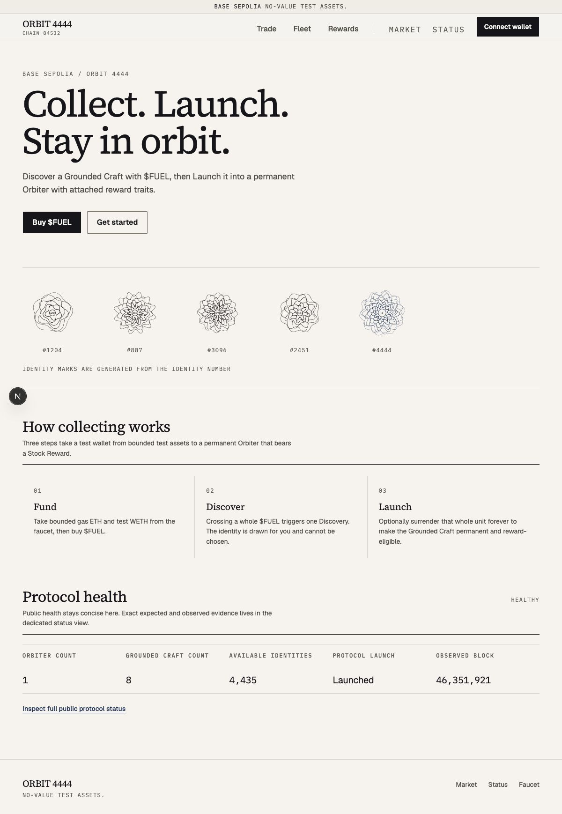
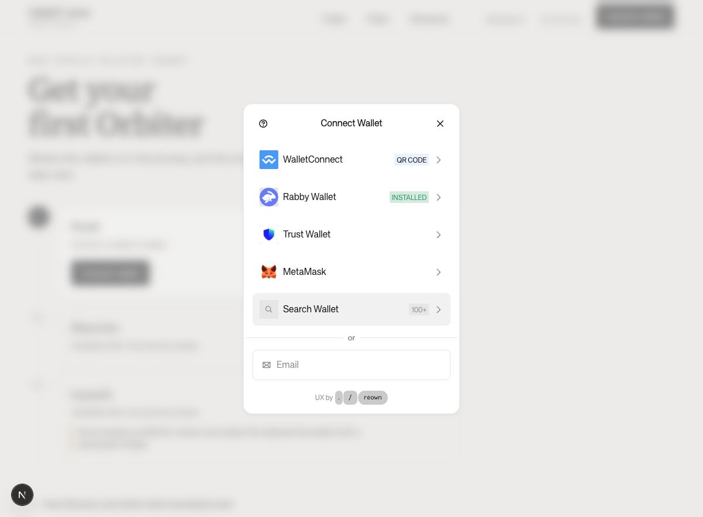
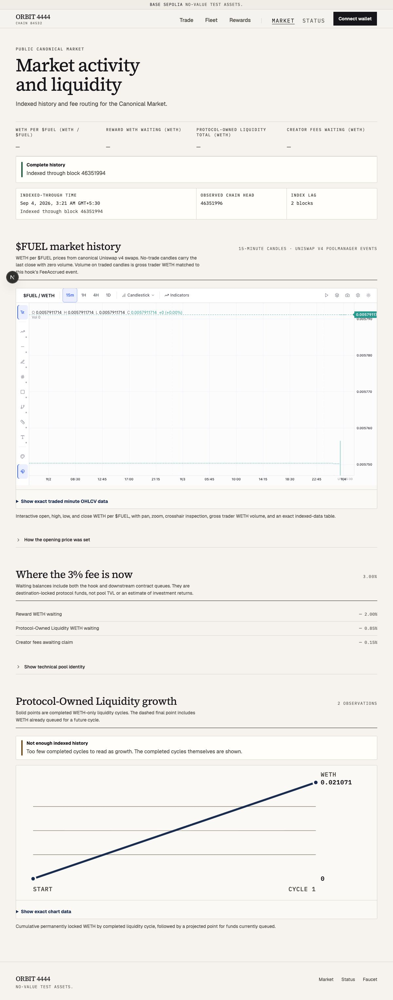
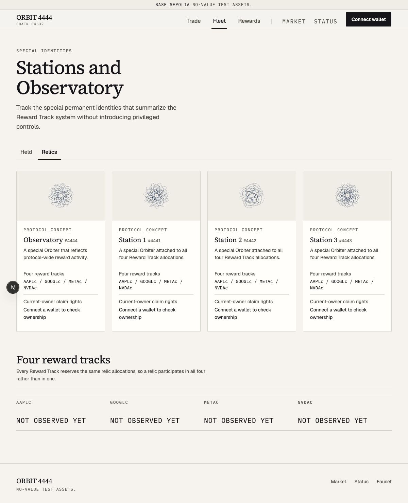
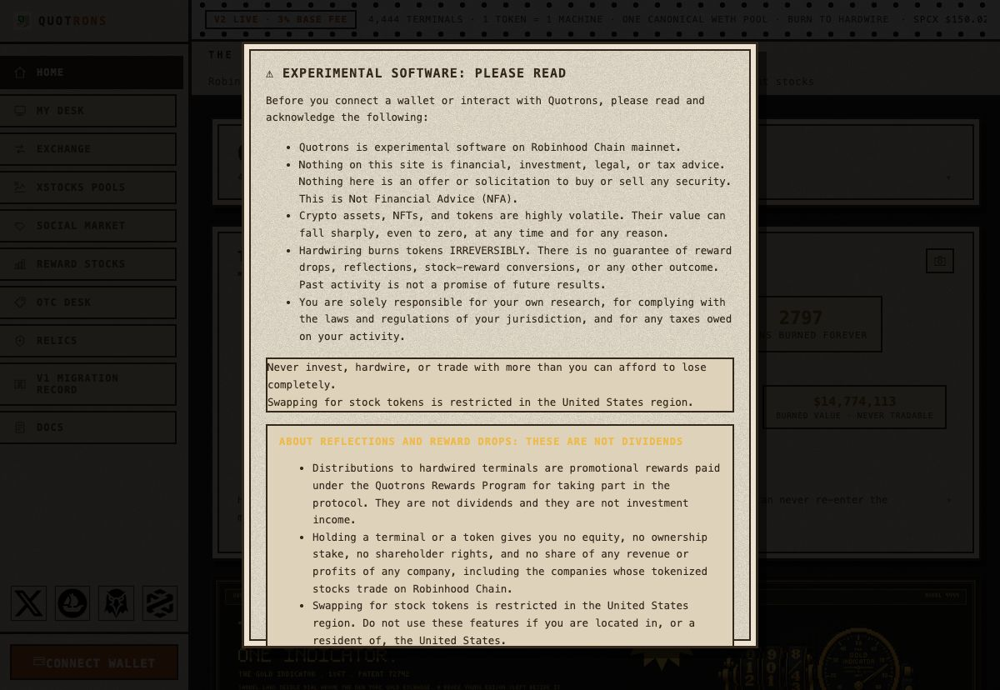

# ORBIT 4444 product-experience and competitive audit

The implemented decision/explanation/proof mapping is maintained in the [collector content inventory](./2026-09-04-content-inventory.md).

**Date:** 2026-09-04  
**Branch:** `audit/ux-competitive-review` from `origin/main` at `b2f2cd1`  
**Scope:** Collector application, public evidence surfaces, wallet entry, failure and empty states, admin sign-in, responsive/accessibility coverage, and a read-only comparison with the public QUOTRONS application.

## Executive verdict

ORBIT already looks intentional. The warm-paper Ledger system, typographic hierarchy, exact evidence disclosures, cautious transaction model, visible testnet labeling, and admin sign-in are stronger than a typical protocol front end. This is not a visual rescue.

The remaining gap is product legibility and emotional value. A new visitor sees a polished mechanism, but has to learn ORBIT's vocabulary before they understand why they should care. The most valuable objects—Grounded Crafts, Orbiters, Stations, the Observatory, and Reward Stocks—are either hidden behind a wallet or presented as repeated protocol records. The public Market is the opposite: it exposes a professional charting terminal before the amount of available data justifies that complexity. Live public reads can leave important values as em dashes for roughly 10–13 seconds, which makes a polished page feel unfinished.

The target is a **trust-first collectible product with progressive financial detail**:

- lead with one human-readable collecting journey;
- make objects distinctive before asking for wallet access;
- put the decisive trade review before the submission control;
- show last-known public evidence immediately, then refresh it live;
- keep advanced evidence and charting available without making it the default;
- add operator, safety, verification, and change-history documentation;
- use restrained motion to explain state changes, not decorate data.

### Experience scorecard

| Area                         | Assessment                         | What that means                                                                                                                                                                        |
| ---------------------------- | ---------------------------------- | -------------------------------------------------------------------------------------------------------------------------------------------------------------------------------------- |
| Visual foundation            | Strong                             | The Ledger system is distinctive, coherent, restrained, and worth preserving.                                                                                                          |
| Accessibility baseline       | Strong                             | Keyboard focus, skip link, minimum controls, semantic status, and automated WCAG checks are unusually deliberate.                                                                      |
| Transaction integrity        | Strong foundation, hierarchy issue | Quote freshness, limits, slippage, deadline, minimum received, and failures are modeled carefully; the ready-to-submit review is visually below the submit button.                     |
| First-run clarity            | Needs work                         | Two hero CTAs compete and the explanation begins in domain language. The guided `/start` journey should be the front door.                                                             |
| Public performance/trust     | Needs work                         | Long live-read waits and mixed readiness states leave visible em dashes after other sections claim completeness.                                                                       |
| Collection desirability      | Major opportunity                  | Generated marks are coherent but identities and relics need differentiated story, state, and reward meaning.                                                                           |
| Market usability             | Needs simplification               | The default terminal is larger and more complex than the five observed intervals justify.                                                                                              |
| Empty/disconnected states    | Functional, too inert              | Recovery is clear, but Fleet and Rewards show mostly dead metrics or absence rather than a useful preview and next step.                                                               |
| Documentation/operator trust | Missing product layer              | Status is transparent, but there is no equivalent of an About, verification center, glossary, safety guide, or change/incident archive.                                                |
| Motion and micro-interaction | Inconsistent                       | Dialogs, disclosures, hover, reduced motion, and transaction progress are good; page entrances are slow/duplicated, mobile navigation snaps, and journey progression lacks continuity. |

## Method and limitations

The audit used a linked Git worktree so the agent already working on `main` was not disturbed. The audited application ran from the audit branch with its local public API and history worker. Chrome was used to navigate the application as a disconnected visitor, open the real wallet chooser, exercise disclosures, test keyboard focus, inspect errors/404s, and visit the public QUOTRONS routes. No wallet was connected and no transaction or signature was requested.

The native macOS Computer Use bridge was also attempted three times—first by bundle identifier and then twice by display name after confirming Chrome was running—but it returned `cgWindowNotFound`. Chrome's extension-based controls remained available and were used for the real browser audit. Responsive and connected/wrong-network/data states were covered separately by the repository's production Playwright fixtures.

QUOTRONS presents a long legal acknowledgment before interaction. The audit did not accept that acknowledgment because it is a consequential consent action. Public routes were inspected read-only by direct navigation and DOM inspection behind the gate. No design, copy, artwork, or terminology should be copied; the comparison is about product patterns.

Design read: this is a redesign-preserve audit for crypto-literate but cautious collectors. Preserve ORBIT's Ledger identity and information architecture unless a recommendation below explicitly changes the journey. Current/target dials are approximately: design variance **3 → 5**, motion **3 → 4**, collector density **4 → 4**, admin density **8 → 8**.

## What must be preserved

1. The testnet banner is persistent and explicit: “Base Sepolia · no-value test assets.”
2. Public protocol health exists before wallet connection and links to a deeper evidence view.
3. Transaction state is modeled from simulation through confirmation, with retriable and outcome-unknown states.
4. Trade terms include execution price, price impact, fee, minimum received, quote block, slippage tolerance, and deadline.
5. Whole-token Discovery and permanent Launch consequences are explained and blocked when evidence is incomplete.
6. The launch dialog is a real alert dialog with a deliberate irreversible confirmation step.
7. Exact onchain values remain available through searchable disclosures rather than contaminating the primary reading layer.
8. The admin sign-in clearly distinguishes a signature from a transaction and explains the short-lived host-only session.
9. Keyboard focus, skip navigation, reduced-motion handling, status semantics, and 44px primary controls are first-class concerns.
10. The visual system—warm canvas, ink, deep blue accent, serif display, mono evidence, hairlines, restrained radii—has a coherent point of view.

## Priority backlog

### P0 — Make `/start` the single first-run path

**Evidence:** The home hero sends its strongest button directly to `/exchange` and its secondary button to `/start` (`apps/web/src/app/(collector)/page.tsx:29`). In Chrome, “Buy $FUEL” and “Get started” read as two competing beginnings. The introduction uses Grounded Craft, $FUEL, Launch, Orbiter, and reward traits before explaining the basic loop.

**User impact:** A newcomer can enter a trading form before knowing that they need test ETH/WETH, that every whole $FUEL boundary creates a random collectible, and that Launch permanently surrenders a whole unit.

**Recommendation:**

- Make “Start collecting” the single primary hero action and route it to `/start`.
- Keep “Trade $FUEL” as a quieter secondary route for returning users.
- Add one plain-language sentence above the fold: what the user needs, what buying does, what is random, and what becomes irreversible later.
- Let `/start` own connection, network switching, faucet, trade, Discovery, and Launch progression.
- Preserve the current domain terms, but introduce each immediately after its plain-English meaning.
- Keep progress visible after navigation so the user always sees the next valid action.

**Acceptance criteria:** A first-time visitor can answer “What is this?”, “What do I need?”, “What happens when I buy?”, “What is random?”, “What is irreversible?”, and “What do I do next?” without opening a disclosure or visiting another route.

### P0 — Put the decisive trade review before the submit action

**Evidence:** `ExchangeActions` renders before `ExchangeReviewChecklist` (`apps/web/src/components/exchange-panel.tsx:603`), while the ready review contains the sentence the trader is expected to read (`exchange-review-checklist.tsx:112`). The detailed terms are correctly available, but they are collapsed after the action.

**User impact:** The strongest visual control can be reached before the user sees the final receive amount, minimum received, fee, price impact, quote freshness, and Discovery consequence as one decision.

**Recommendation:**

- Place a compact, stable review summary directly above the submit button.
- Always show: pay, expected receive, minimum receive, fee, price impact when available, quote block/age, and the exact Discovery/whole-unit effect.
- Keep the full seven-row terms disclosure below as evidence.
- Do not move the button as data arrives; reserve the summary's space or update it in place.
- Keep the current fail-closed quote, evidence, balance, and transaction rules.

**Acceptance criteria:** The DOM and visual order is input → current quote summary → submit → full terms/evidence; no enabled submit control appears before a current review; quote expiry invalidates both summary and action atomically.

### P0 — Serve coherent public evidence immediately

**Evidence:** Direct Chrome navigation to `/status` remained in its loading presentation for roughly 10–13 seconds before becoming Healthy. On `/market`, indexed history could report “Complete history” while the four headline metrics still showed em dashes. The production build also warned that social URLs fall back to `http://localhost:3000` when `NEXT_PUBLIC_APP_URL` is absent at build time (`apps/web/src/app/layout.tsx:12`).

**User impact:** Empty-looking metrics and conflicting readiness signals reduce trust more than an explicit stale timestamp would. Localhost social metadata is a visible release-quality failure when links are unfurled.

**Recommendation:**

- Render the most recent indexed/public snapshot immediately with an “as of block/time” label.
- Refresh live RPC evidence in the background and distinguish “last known,” “refreshing,” “stale,” and “unavailable.”
- Establish an 8-second maximum before offering Retry and a reason; never leave only em dashes indefinitely.
- Treat page-level readiness coherently: if history and health arrive independently, label the source and timestamp of each.
- Require the canonical public origin in release builds and test absolute Open Graph, Twitter, icon, and wallet metadata URLs.

**Acceptance criteria:** Meaningful public values or an explicit last-known state appear within one second of shell hydration; a slow live refresh never erases known values; timeout recovery is actionable; a production build cannot silently publish localhost metadata.

### P1 — Make Market progressive rather than terminal-first

**Evidence:** The chart is `clamp(34rem, 68vh, 44rem)` tall (`apps/web/src/app/styles/market.css:55`) and enables toolbar, drawing tools, object tree, settings, persistence, resampled timeframes, and dozens of professional controls (`market-candlestick-chart.tsx:841`). At audit time the accessible series described five traded intervals and the page was roughly 3,052px tall. The exact table exposes large raw integer values. “Inspect PoolManager” did not inherit the shared 44px text-link target.

**User impact:** Sparse testnet history is framed like an advanced trading workstation, pushing fee routing and protocol-owned liquidity—the differentiated information—far below the fold. Mobile users must horizontally swipe a vendor toolbar they may not need.

**Recommendation:**

- Default to a concise ORBIT-native price/volume chart at 360–480px with range controls and a clear empty/sparse state.
- Offer “Open advanced chart” for drawings, indicators, object tree, persistence, and screenshot tools.
- Put price, latest trade, 24h/available-range volume, data freshness, and source above the chart.
- Human-format the exact-history table; expose raw integer units through a copy action or nested exact-value disclosure.
- Move fee routing and POL growth into a compact summary immediately after the price chart.
- Give every chart/disclosure/explorer action a 44px target and verified accessible name.

**Acceptance criteria:** A newcomer can interpret the market without interacting with vendor tools; sparse history does not produce a mostly empty 44rem terminal; advanced users can still reach the full terminal in one action; all controls pass target-size and keyboard tests.

### P1 — Turn collection, rewards, and relics into reasons to care

**Evidence:** Disconnected Fleet leads with six empty metrics. Rewards largely says to connect and claim, without explaining the four tracks. Relics repeats nearly identical art, “Protocol concept,” reward-track copy, and ownership rows across four cards, then repeats the tracks as “Not observed yet.”

**User impact:** The product asks for wallet access before it makes the collectible, permanence, rarity, reward attachment, or special identities emotionally legible.

**Recommendation:**

- Give disconnected Fleet a clearly labeled preview of the collection model plus one path to start; hide or demote dead metrics.
- Make each identity card answer: state, identity number, acquired/observed time, Launch consequence, attached traits, reward eligibility, and next action.
- Explain all four Reward Tracks before connection, then layer wallet-specific accrued/eligible Stock Reward amounts on top.
- Give the Observatory and each Station distinct art direction, purpose, allocation meaning, and protocol history while retaining ORBIT's original names and generated-identity system.
- Combine repeated relic information into a shared comparison and reserve each card for what is unique.
- Consider a future read-only transfer/listing surface only after core ownership and reward evidence is reliable; do not imitate QUOTRONS' OTC mechanics without a separate product decision.

**Acceptance criteria:** A disconnected visitor can explain the difference between Grounded Craft, Orbiter, Station, Observatory, and Stock Reward; every special identity is recognizable without reading its number; connected empty states lead to a valid next action instead of a ledger of dashes.

### P1 — Add a compact trust and verification center

**Evidence:** `/status` is strong on point-in-time protocol evidence, but the public shell has no About/operator identity, glossary, contract verification index, safety guide, change/incident history, or coherent documentation route. QUOTRONS demonstrates the trust value of these surfaces, although its single giant Docs page and mandatory legal wall are too heavy.

**Recommendation:**

- Add a compact Learn/Verify entry rather than several new top-level navigation items.
- Cover the collecting loop, glossary, Base Sepolia/no-value scope, contracts by chain, fee routing, reward methodology, Launch irreversibility, wallet safety, and exact external verification links.
- Add operator/entity/contact details appropriate to the project.
- Publish protocol changes, migrations, pauses, incidents, and recoveries in a permanent read-only record.
- Keep disclosures contextual near actions; do not move all safety language into a gate.

**Acceptance criteria:** A cautious user can independently verify deployed addresses and mechanics, identify the operator/contact, understand known limitations, and review material protocol history without connecting a wallet.

### P1 — Make wallet entry feel like ORBIT

**Evidence:** The real Reown chooser is functional but reads as a generic white rounded modal with provider branding and a long equal-weight list: WalletConnect, Rabby, Trust, MetaMask, search, and email. The surrounding Ledger page is substantially more distinctive.

**Recommendation:**

- Precede the chooser with a concise ORBIT-owned explanation of why connection is needed, supported chain, no-value assets, and that connection itself is not a transaction.
- Prioritize detected/recommended options; demote search and secondary methods.
- Confirm whether email login is intentional for this product and remove it if it creates an account model the rest of the app does not explain.
- Keep Reown's accessible mechanics, but align surface radius, typography, accent, and copy as far as supported.

**Acceptance criteria:** The user knows why they are connecting and what happens next before choosing a provider; the modal does not imply unsupported account or network paths; visual treatment feels related to Ledger without forking inaccessible wallet UI.

### P2 — Complete the small-surface polish pass

**Evidence and fixes:**

- The global 404 has the branded typography but no normal shell/navigation/footer, while invalid identity routes retain the shell (`global-not-found.tsx:8`). Use one recovery pattern.
- The brand link's accessible name concatenates wordmark and chain context. Give it an intentional label such as “ORBIT 4444 home.”
- The only 10px visible copy found was the header chain identifier. Recheck it on low-density/zoomed displays.
- `Inspect PoolManager` is a plain anchor (`market-dashboard.tsx:277`); give it the shared text-link hit target.
- Update stale implementation documentation: the design foundations still describe a legacy dark admin theme, while the application uses the Ledger system; `browser/matrix.ts:15` says the app is dark-only while the wallet and design foundation are light-only.
- Decide whether the floating circular “N” control is product-critical; it visually competes with content and needs a clear accessible purpose.
- Remove or repair the unused `Reveal` primitive. It starts and ends at the same visual state (`motion-primitives.tsx:49`) and currently has no consumers.
- Centralize the four duplicated 500ms entrance helpers and shorten task-surface entrances.

## Route-by-route findings

| Route               | What works                                                                                      | Highest-value improvement                                                                                                          |
| ------------------- | ----------------------------------------------------------------------------------------------- | ---------------------------------------------------------------------------------------------------------------------------------- |
| `/`                 | Distinctive hero, coherent marks, clear three-step section, public health                       | Make `/start` primary; translate the mechanism before introducing five terms.                                                      |
| `/start`            | Excellent state-derived three-phase journey; valid next actions                                 | Treat it as the main product entry and animate phase progression, not only mount.                                                  |
| `/faucet`           | Honest bounded assets and clear “never $FUEL” scope                                             | Replace backend phrases such as browser not holding a signer with user-level safety copy; keep technical evidence in a disclosure. |
| `/exchange`         | Strong fail-closed state machine, quote freshness, balances, recovery, and exact terms          | Put the compact decisive review above submit; reduce disconnected ETH/WETH mental load.                                            |
| `/fleet`            | Equal-column metrics, collection/explorer links, state-aware cards                              | Make disconnected/empty states educational and desirable; “Held” needs a more explicit label.                                      |
| `/fleet/[id]`       | Clear read failure, retry, and two explorer links; invalid IDs are rejected                     | Improve loading continuity and make successful identity state the emotional center of the product.                                 |
| `/rewards`          | Current-owner policy and exact-unit language are honest; claim is safely disabled               | Explain tracks and allocation before connection; show wallet-specific detail as enhancement.                                       |
| `/relics`           | Correctly represents all four special identities                                                | Remove repeated generic cards; give each identity distinct meaning, art, and history.                                              |
| `/market`           | Transparent history source/lag, degraded states, exact evidence, accessible chart summary       | Default to a compact chart and progressive advanced mode; surface coherent metrics sooner.                                         |
| `/status`           | Excellent point-in-time caveat, destination-locked funds, observed block, external verification | Serve last-known evidence immediately and provide timeout/retry before a 10–13s wait.                                              |
| `/admin/sign-in`    | Best-in-class explanation of signature, session, chain, and steps                               | Preserve; add a clear route back to collector context if not already reachable at narrow widths.                                   |
| Global/identity 404 | Clear branded message and home recovery                                                         | Use the same shell and escape routes for both shapes.                                                                              |

## QUOTRONS: learn from the product, not the skin

### Patterns worth adapting

1. **Visible proof creates credibility.** Live supply, status, pool, fee, and reward values make the product feel inhabited rather than conceptual.
2. **Objects have stories.** Special machines are named, visually distinct, historically contextualized, and tied to exact reward meaning.
3. **Due diligence sits near action.** Buyers can inspect a terminal, attached/pending rewards, router/hook, slippage, fee split, contracts, and data source at the point of decision.
4. **Ownership and rewards meet in one place.** The OTC surface makes listings and attached rewards legible together.
5. **Incidents and migrations remain visible.** A permanent read-only record demonstrates operational maturity.
6. **Verification is self-service.** Addresses, external links, copy controls, API references, glossary, and event/error references reduce dependence on community support.
7. **Brand is unmistakable.** Every surface feels like the same product.

### Patterns to reject

1. Do not put a long, scroll-heavy legal consent wall in front of basic exploration.
2. Do not copy the large number of top-level destinations; keep ORBIT's navigation calm.
3. Do not copy persistent tickers, marquees, all-caps density, or speculative dollar totals.
4. Do not turn Learn/Verify into one enormous data dump.
5. Do not use QUOTRONS' names, art, mechanical framing, financial promises, or terminal aesthetic.
6. Do not let advanced market/developer detail become the default newcomer experience.

## Motion audit

Motion should remain low-frequency and functional. The system already has good 120/180/240ms CSS tokens, a consistent `cubic-bezier(0.16, 1, 0.3, 1)` ease, reduced-motion fallbacks, an effective 180ms disclosure, a 180ms dialog, subtle 180ms card hover, and a functional pending-transaction sweep.

### Opportunities

| Priority | Where                                                      | Trigger and target                                | Exact treatment                                                                                                                                                                                                             | Why it passes the gate                                                                                     |
| -------- | ---------------------------------------------------------- | ------------------------------------------------- | --------------------------------------------------------------------------------------------------------------------------------------------------------------------------------------------------------------------------- | ---------------------------------------------------------------------------------------------------------- |
| 1        | `collector-shell.tsx:158`                                  | Mobile menu open/close                            | Keep the panel mounted during exit; opacity 0→1 and translateY -6px→0 over 180ms with `var(--ease-standard)`; reverse over 120ms. Crossfade Menu/X over 120ms. Reduced motion: immediate.                                   | Frequent enough to matter, directly explains a spatial relationship, and removes the current display snap. |
| 2        | `onboarding-panel.tsx:134`                                 | A phase changes waiting → current → complete      | Transition border/background/rail color over 180ms; crossfade the state label over 120ms; reveal the current action with opacity plus 4px y over 180ms. No card translation or celebratory loop. Reduced motion: immediate. | Occasional, communicates progression and causal feedback after wallet/funding/trade state changes.         |
| 3        | `craft-detail-panel.tsx:390`                               | Confirmed Launch changes Grounded Craft → Orbiter | After confirmed refresh, crossfade the state label and affected reward/ownership rows over 240ms; apply one 240ms accent hairline sweep. Preserve layout and focus. Reduced motion: immediate.                              | Rare, meaningful, and explains the product's irreversible state transition without spectacle.              |
| 4        | `protocol-summary.tsx` and Market headline metrics         | Placeholder/last-known value becomes live         | Preserve value width; crossfade old → new text over 120ms and briefly transition the “as of” label color over 180ms. Never roll numbers. Reduced motion: immediate.                                                         | Occasional, reduces visual teleporting while preserving numerical readability.                             |
| 5        | Shared mount entrances in onboarding/faucet/relics/rewards | Initial task surface mount                        | Replace duplicated 500ms/12px entrances with one shared 240ms/6px primitive; cap stagger at 40ms and three items. Remove the phantom three-slot header delay because `PageHeader` is static.                                | First-load only; shorter treatment improves continuity without slowing a task.                             |

### Rejected candidates

| Candidate                                                | Rejection reason                                                                                                        |
| -------------------------------------------------------- | ----------------------------------------------------------------------------------------------------------------------- |
| Global page/route transitions                            | Navigation is frequent and task-oriented; motion would delay orientation and complicate focus/scroll restoration.       |
| Animated market candles, axes, or rolling numeric values | Financial evidence should update instantly and remain comparable; animation can imply interpolation that did not occur. |
| Looping collectible marks or ambient hero motion         | Pure decoration, battery cost, and conflict with the restrained Ledger identity.                                        |
| Animated error/disabled feedback                         | These can change repeatedly during quote entry; a fade would obscure actionable state.                                  |
| More hover lift or glow                                  | Existing 2px card lift and color transitions are sufficient; additional effects would weaken the print-like system.     |

**Motion verdict:** Improve three state transitions and one mobile spatial transition, then stop. The higher priority is removing slow duplicated entrance choreography, not adding spectacle.

## Evidence

### ORBIT home

### ORBIT wallet entry

### ORBIT live Market

### ORBIT special identities

### QUOTRONS first-run gate

Additional captures cover Exchange, Fleet, Rewards, Status, Faucet, identity failure, admin sign-in, degraded/live Market and Status states. `screenshots/quotrons-route-audit.json` records the public comparison route text and action inventory.

## Validation record

- `pnpm --dir apps/web build` — passed; emitted the missing-`metadataBase` warning documented above.
- `pnpm --dir apps/web test:a11y` — passed 15 route states and 4 security-header response states.
- `pnpm --dir apps/web test` — passed 84 test files and 682 tests.
- `pnpm --dir apps/web lint` — passed with zero warnings.
- Production browser matrix — passed all 116 cases. It covers all public routes at 375, 768, 1024, and 1440px; focused 320/781/1161/1200px shell regressions; disconnected, connecting, wrong-network, ordinary, loading, empty, failed, stale, funded, cooldown, and budget-disabled fixtures; admin capability redirects; axe, focus, overflow, collision, and idle-request checks. See `browser-matrix-report.json` for the machine-readable result.

Automated passes establish baseline correctness, not product excellence. They do not measure vocabulary burden, CTA hierarchy, emotional value, appropriate information density, live-RPC latency, or whether a technically accessible advanced terminal is the right default.

## Recommended delivery sequence

1. First-run path and pre-submit hierarchy.
2. Last-known public snapshots, timeouts, coherent readiness, and release metadata.
3. Market progressive disclosure and touch targets.
4. Fleet/Rewards/Relics content model and art direction.
5. Learn/Verify/About/history trust layer and wallet-entry framing.
6. Focused motion pass and small consistency cleanup.

## Work tracking

Current work is tracked in [hrsh22/ethonline-26](https://github.com/hrsh22/ethonline-26/issues).
The issue numbers below belong to the original audit and have not been migrated to this repository.

- Original #102: World-class collector experience map
- Original #105: Single first-run path
- Original #104: Trade review before submission
- Original #106: Coherent public evidence and release metadata
- Original #108: Progressive Market disclosure
- Original #109: Fleet, Rewards, and Relics product storytelling
- Original #107: Learn, Verify, About, and protocol history
- Original #103: Wallet entry, motion, 404, and small-control polish

Do not start with decorative animation or a broad reskin. The strongest near-term result comes from making the existing system easier to understand, safer to decide in, faster to trust, and more rewarding to explore.
